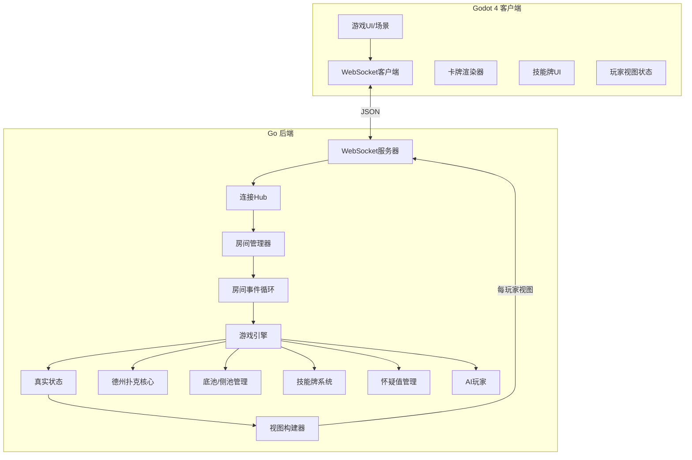
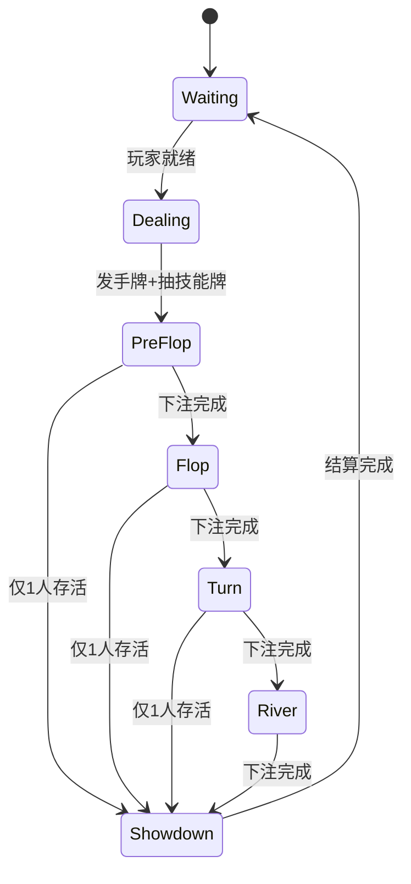
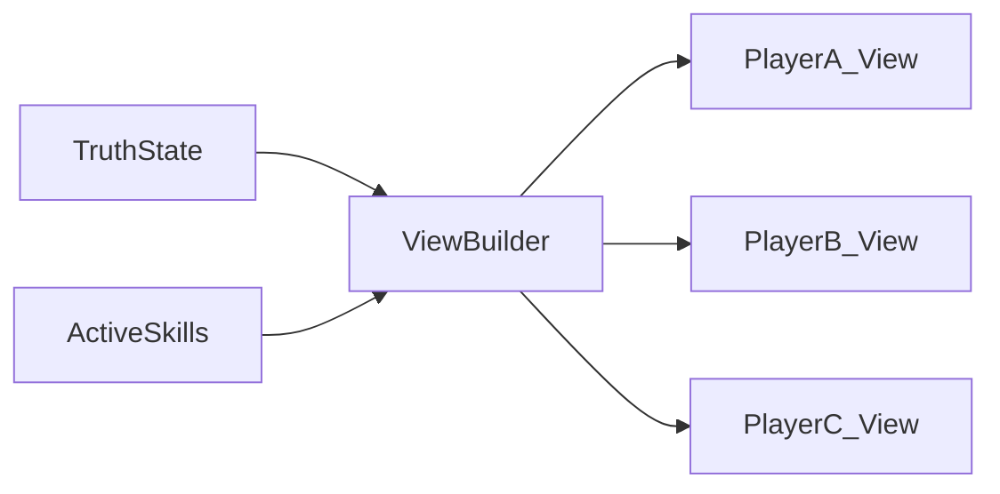
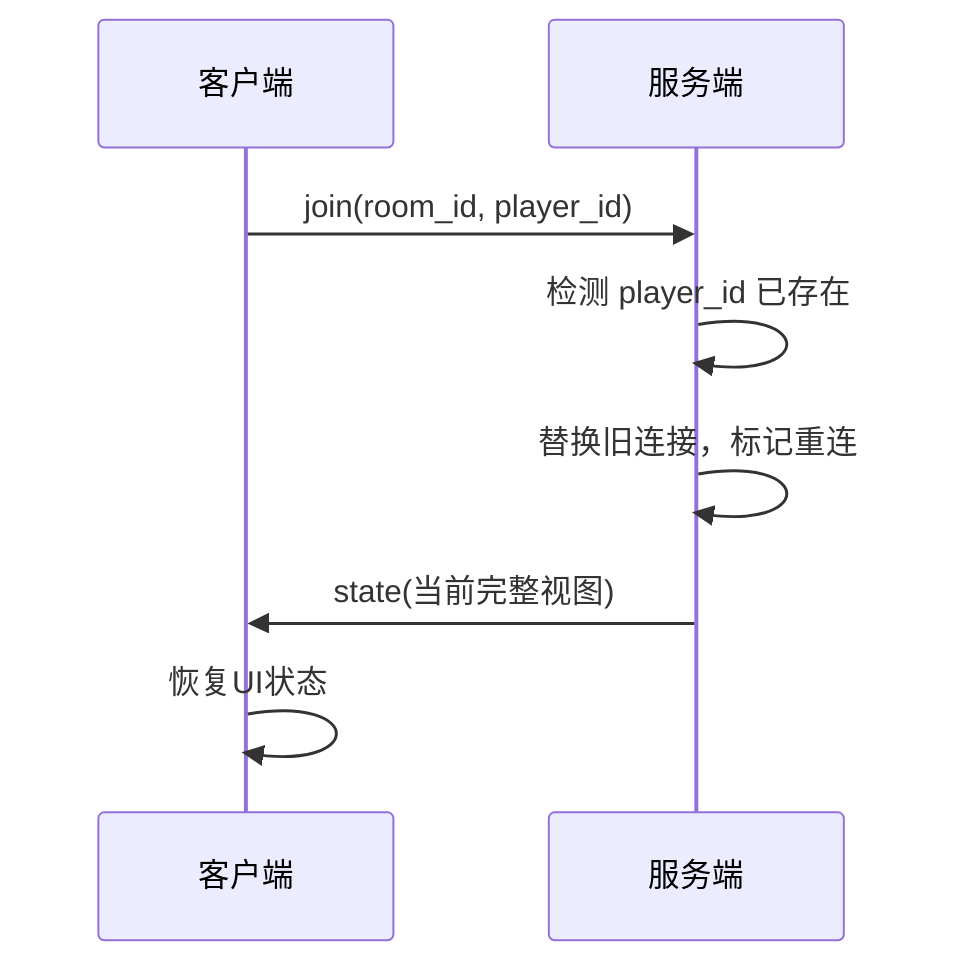

# 千术德州扑克游戏 - 技术方案 (V1)

## 项目概述

构建一款创新德州扑克游戏，核心玩法：**德州扑克 + 技能牌(千术) + 怀疑值系统**

技术栈：**Godot 4 (客户端) + Go (服务端) + WebSocket (通信)**

> **V1 范围说明**：本文档为第一版实现范围，标注 `[后续]` 的内容留待后续版本。

---

## 第零阶段：环境搭建

### 1. Go 环境安装 (Linux)

```bash
# 下载 Go 1.22+ (推荐 1.22.x 或更高)
wget https://go.dev/dl/go1.22.0.linux-amd64.tar.gz

# 解压到 /usr/local
sudo tar -C /usr/local -xzf go1.22.0.linux-amd64.tar.gz

# 配置环境变量 (添加到 ~/.bashrc)
export PATH=$PATH:/usr/local/go/bin
export GOPATH=$HOME/go
export PATH=$PATH:$GOPATH/bin

# 验证安装
go version
```

### 2. Godot 4 安装 (Linux)

```bash
# 方案A: 下载官方二进制
wget https://github.com/godotengine/godot/releases/download/4.3-stable/Godot_v4.3-stable_linux.x86_64.zip
unzip Godot_v4.3-stable_linux.x86_64.zip

# 方案B: 使用 Flatpak (推荐，自动更新)
flatpak install flathub org.godotengine.Godot
```

**注意**：Godot 4 Web 导出需要安装导出模板：

- 打开 Godot -> Editor -> Manage Export Templates -> Download

### 3. 项目初始化

```bash
cd /BG-POC-VEPFS/victorhe/DirtyPlay

# 创建项目结构
mkdir -p client server docs

# 初始化 Go 模块
cd server
go mod init dirtyplay-server

# 安装 Go 依赖
go get github.com/gorilla/websocket
go get github.com/google/uuid
```

---

## 架构设计



---

## 目录结构

```
DirtyPlay/
├── client/                      # Godot 4 项目
│   ├── project.godot
│   ├── scenes/
│   │   ├── main_menu.tscn       # 主菜单
│   │   ├── game_table.tscn      # 牌桌场景
│   │   └── components/
│   │       ├── card.tscn        # 卡牌组件
│   │       ├── player_seat.tscn # 玩家座位
│   │       └── skill_card.tscn  # 技能牌
│   ├── scripts/
│   │   ├── autoload/
│   │   │   ├── game_manager.gd  # 游戏状态管理
│   │   │   └── network.gd       # WebSocket管理
│   │   ├── game/
│   │   │   └── skill_manager.gd
│   │   └── ui/
│   ├── assets/
│   │   ├── cards/               # 扑克牌素材
│   │   ├── skills/              # 技能牌图标
│   │   └── fonts/
│   └── export_presets.cfg       # Web导出配置
│
├── server/                      # Go 后端
│   ├── go.mod
│   ├── go.sum
│   ├── cmd/
│   │   └── server/
│   │       └── main.go          # 唯一入口
│   └── internal/
│       ├── ws/
│       │   ├── hub.go           # 连接管理
│       │   ├── client.go        # 客户端连接
│       │   └── message.go       # 消息定义
│       ├── game/
│       │   ├── room.go          # 房间管理
│       │   ├── event_loop.go    # 房间事件循环
│       │   ├── table.go         # 牌桌逻辑
│       │   ├── player.go        # 玩家状态
│       │   ├── pot.go           # 底池/侧池管理
│       │   ├── state.go         # 游戏状态机
│       │   └── view_builder.go  # 视图构建器
│       ├── poker/
│       │   ├── card.go          # 卡牌定义
│       │   ├── deck.go          # 牌堆
│       │   ├── hand.go          # 牌型判断
│       │   └── evaluator.go     # 胜负计算
│       ├── skill/
│       │   ├── skill.go         # 技能定义
│       │   ├── effects.go       # 技能效果
│       │   └── heat.go          # 怀疑值系统
│       └── ai/
│           └── bot.go           # AI玩家
│
└── docs/
    └── game_plan.md             # 本文档
```

---

## 核心系统设计

### 1. 德州扑克游戏流程 (V1 简化版)



> V1 去掉独立的"技能窗口"阶段，技能统一在自己行动回合使用。

### 2. 技能牌系统 (V1)

| 类型 | 技能名 | 效果 | 怀疑值+ | 影响范围 |
|------|--------|------|---------|----------|
| 信息 | 窥视 | 看对手一张手牌 | +15 | 仅视图 |
| 欺诈 | 虚张声势 | 对手看到你的假手牌(本街) | +20 | 仅视图 |
| 欺诈 | 迷雾 | 对手看错一张公共牌(本街) | +25 | 仅视图 |
| 操作 | 换牌 | 弃一张手牌，从牌堆顶抽一张 | +30 | **真实状态** |
| 防御 | 反侦察 | 免疫一次信息技能 | +5 | 仅视图 |

> **V1 移除的技能**：预知、移形换影（复杂度高，留待后续）

**技能使用规则 (V1)：**

- **使用时机**：仅在自己行动回合，下注动作前可使用
- **每回合限制**：每个行动回合最多使用 1 张技能牌
- **被动技能**：反侦察自动触发，不占用主动使用次数

**技能获取 (V1 简化)：**

- 每手牌开始：抽 1 张
- 每条街结束：30% 概率抽 1 张
- 手牌上限：3 张
- **抽取方式**：从技能列表随机抽取（可重复），不维护牌池

---

## 技能系统核心规则

### 设计原则：视图 vs 真实状态

**核心规则：除「换牌」外，其他技能仅影响视图，不改变真实牌面**

| 技能 | 真实状态 | 使用者视图 | 目标视图 |
|------|----------|------------|----------|
| 窥视 | 不变 | 看到对手真实手牌 | 不知道被窥视 |
| 虚张声势 | 不变 | 正常 | 看到假手牌(本街) |
| 迷雾 | 不变 | 正常 | 看到错误公共牌(本街) |
| 换牌 | **手牌变化** | 新手牌 | 无影响 |
| 反侦察 | 不变 | 被保护提示 | 技能被抵消 |

### 换牌与牌序

- 换牌时从**牌堆顶部**抽取（保持牌序可预测性）
- V1 不追踪弃牌堆，换牌弃掉的牌直接丢弃，不影响后续

### 反侦察消耗规则

- 反侦察为被动触发技能
- **触发即消耗**：成功抵消一次信息技能后，该反侦察牌从手牌移除
- 每张反侦察只能使用一次

### 技能结算顺序

```
1. 防御类优先判定 (反侦察)
2. 信息类次之 (窥视)
3. 欺诈类 (虚张声势、迷雾)
4. 操作类最后 (换牌)
```

同优先级按使用时间顺序结算。

---

## 盲注与加注规则 (V1)

### 盲注设定

| 参数 | V1 默认值 | 说明 |
|------|-----------|------|
| 小盲 (SB) | 5 | 庄家左侧第一位 |
| 大盲 (BB) | 10 | 庄家左侧第二位 |
| 起始筹码 | 1000 | 每位玩家初始筹码 |

### 最小加注规则

```
min_raise = max(BB, 上一次有效加注额)
```

- **翻牌前首次加注**：min_raise = BB（即最小加注到 2×BB = 20）
- **后续加注**：min_raise = 上一次加注的增量
- **示例**：玩家A加注到30（增量20），玩家B若要再加注，最小加注到50（30+20）

### 行动顺序

**翻牌前 (PreFlop)：**
1. 大盲左侧第一位 (UTG) 先行动
2. 顺时针轮流，大盲最后行动

**翻牌后 (Flop/Turn/River)：**
1. 庄家左侧第一位（小盲位或其后最近的存活玩家）先行动
2. 顺时针轮流，庄家最后行动

### 下注回合结束条件

下注回合在以下条件**同时满足**时结束：

1. 所有未弃牌且未 all_in 的玩家都已完成至少一次行动
2. 所有未弃牌且未 all_in 的玩家当前轮投入金额相等

**注意**：all_in 玩家不参与后续行动判定，即使其投入金额小于当前最大注。

---

## All-in 与侧池规则 (V1)

### All-in 定义

- **触发条件**：自己行动回合，金额 = 当前全部筹码
- **动作类型**：`all_in`（独立动作，不是 raise 的变种）

### All-in 与行动重开

| 情况 | 条件 | 行为 |
|------|------|------|
| 跟注不足 | `all_in < to_call` | 视为跟注，**不重开**行动 |
| 有效加注 | `all_in >= to_call + min_raise` | 视为加注，**重开**行动 |
| 不足加注 | `to_call <= all_in < to_call + min_raise` | 视为跟注+额外投入，**不重开**行动 |

### All-in 后的玩家状态

- 状态变为 `all_in`
- 本手牌不再参与行动，服务器跳过其回合
- 仍参与摊牌比牌

### 侧池计算 (贡献额切片法)

```go
// 简化实现：按玩家总贡献排序，分层生成 pots
type Pot struct {
    Amount      int      // 池底金额
    Eligible    []string // 可赢玩家ID列表
}

func calculatePots(players []Player) []Pot {
    // 1. 收集所有未弃牌玩家的总贡献额
    // 2. 按贡献额排序，找出所有不同的贡献层级
    // 3. 每个层级生成一个 pot：
    //    - 金额 = (当前层级 - 上一层级) × 贡献达到该层级的玩家数
    //    - 可赢玩家 = 贡献额 >= 当前层级 且 未弃牌的玩家
    // 4. 返回所有 pots
}
```

**示例：**

```
玩家A: 贡献 100, 状态 all_in
玩家B: 贡献 300, 状态 all_in  
玩家C: 贡献 300, 状态 active
玩家D: 贡献 0, 状态 folded

结果：
- 主池: 100 × 3 = 300 (A, B, C 可赢)
- 侧池1: (300-100) × 2 = 400 (B, C 可赢)
```

### 侧池结算

1. 每个池独立比牌
2. 最强牌型赢得该池
3. 平局时平分（奇数筹码从庄家左侧顺时针分配）

### UI 展示 (V1)

- V1 只展示总底池金额
- 侧池细节不强制展示（但服务端必须正确计算）
- `[后续]` 展示侧池详情

---

## 状态视图与隔离规则

### 服务端状态分层

```go
// 真实状态 - 服务端唯一权威源
type TruthState struct {
    Deck           []Card           // 真实牌堆(固定顺序)
    CommunityCards []Card           // 真实公共牌
    Players        []PlayerState    // 真实玩家状态
    Pots           []Pot            // 底池/侧池
    CurrentBet     int
    // ...
}

// 玩家视图 - 每个玩家看到的可能不同
type PlayerView struct {
    MyHand           []Card            // 自己的手牌
    CommunityCards   []Card            // 可能被迷雾影响
    OpponentHands    map[string][]Card // 可能被虚张声势影响
    PeekedCards      []Card            // 窥视结果
    TotalPot         int               // V1 只展示总底池
    // ...
}
```

### 视图构建流程



**规则：**

1. 每次状态变化，为每个玩家单独构建视图
2. 视图构建时应用当前生效的技能效果
3. 客户端只接收自己的视图，永远不知道真实状态
4. 摊牌时清除所有视图干扰，展示真实结果

---

## 怀疑值(Heat)系统 (V1 简化)

```go
const (
    MaxHeat          = 100  // 上限
    WarningThreshold = 70   // 警告阈值 - 对手收到提示
    LockoutThreshold = 100  // 锁定阈值 - 无法使用技能
    HeatDecayPerHand = 10   // V1: 仅每手牌结算后衰减
)
```

### 衰减规则 (V1)

| 触发时机 | 衰减量 | 说明 |
|----------|--------|------|
| 每手牌结算后 | -10 | 摊牌或所有人弃牌后触发 |

> `[后续]` 可增加"每条街 -5"的细粒度衰减

### 机制细节

- 怀疑值 ≥ 70：所有对手收到 "此人行为可疑" 提示
- 怀疑值 = 100：技能按钮禁用，无法使用任何技能
- 怀疑值不会低于 0

---

## 通信协议 (JSON)

### 基础消息结构

```go
type Message struct {
    Type    string          `json:"type"`
    Seq     int64           `json:"seq"`      // 消息序号
    Payload json.RawMessage `json:"payload"`
}
```

### V1 消息类型列表

| 方向 | Type | 说明 |
|------|------|------|
| C→S | `join` | 加入/重连房间 |
| C→S | `action` | 游戏动作 |
| C→S | `skill` | 使用技能 |
| C→S | `ping` | 心跳 |
| S→C | `ack` | 动作确认 |
| S→C | `error` | 错误 |
| S→C | `state` | 游戏状态推送 |
| S→C | `action_req` | 请求玩家行动 |
| S→C | `skill_effect` | 技能效果通知 |
| S→C | `pong` | 心跳响应 |

> `[后续]` 增加 `event_log` 用于回放

### 客户端 → 服务端

```go
// 加入房间
type JoinMsg struct {
    RoomID   string `json:"room_id"`
    PlayerID string `json:"player_id,omitempty"` // 重连时带上
    Name     string `json:"name,omitempty"`      // 首次加入时
}

// 游戏动作
type ActionMsg struct {
    Action string `json:"action"` // fold, check, call, raise, all_in
    Amount int    `json:"amount,omitempty"` // 仅 raise 必填；all_in 不需要传，服务端取玩家当前筹码
}

// 使用技能
type SkillMsg struct {
    SkillID  string `json:"skill_id"`
    TargetID string `json:"target_id,omitempty"` // 窥视时指定目标
    CardIdx  int    `json:"card_idx,omitempty"`  // 换牌时指定弃哪张
}
```

### 服务端 → 客户端

```go
// 动作确认
type AckMsg struct {
    Success bool   `json:"success"`
    Error   string `json:"error,omitempty"`
}

// 错误
type ErrorMsg struct {
    Code    int    `json:"code"`
    Message string `json:"message"`
}

// 请求玩家行动
type ActionRequestMsg struct {
    PlayerID     string   `json:"player_id"`
    ValidActions []string `json:"valid_actions"` // 可用动作列表
    ToCall       int      `json:"to_call"`       // 需要跟注金额
    MinRaise     int      `json:"min_raise"`     // 最小加注额
    MaxRaise     int      `json:"max_raise"`     // 最大加注(=筹码，即 all_in)
    CanUseSkill  bool     `json:"can_use_skill"` // 是否可用技能
    TimeoutSec   int      `json:"timeout_sec"`   // 超时秒数
}

// 游戏状态推送 (每玩家视图)
type GameStateMsg struct {
    Phase          string       `json:"phase"`
    TotalPot       int          `json:"total_pot"`       // V1 只展示总底池
    CommunityCards []string     `json:"community_cards"` // 可能被技能影响
    MyHand         []string     `json:"my_hand"`
    MySkills       []SkillInfo  `json:"my_skills"`
    MyHeat         int          `json:"my_heat"`
    Players        []PlayerInfo `json:"players"`
    CurrentPlayer  string       `json:"current_player"`
    DealerSeat     int          `json:"dealer_seat"`
}

type PlayerInfo struct {
    ID          string   `json:"id"`
    Name        string   `json:"name"`
    Seat        int      `json:"seat"`
    Stack       int      `json:"stack"`
    Bet         int      `json:"bet"`           // 本轮已下注
    TotalBet    int      `json:"total_bet"`     // 本手牌总投入
    Status      string   `json:"status"`        // active, folded, all_in
    Hand        []string `json:"hand,omitempty"` // 摊牌或技能效果时
    HeatWarning bool     `json:"heat_warning"`  // 是否可疑(>=70)
}

type SkillInfo struct {
    ID   string `json:"id"`
    Name string `json:"name"`
    Cost int    `json:"cost"` // 怀疑值消耗
}

// 技能效果通知
type SkillEffectMsg struct {
    SkillID  string      `json:"skill_id"`
    UserID   string      `json:"user_id"`
    TargetID string      `json:"target_id,omitempty"`
    Result   interface{} `json:"result,omitempty"` // 技能特定结果
    Blocked  bool        `json:"blocked"`          // 是否被反侦察
}
```

---

## 并发与房间事件循环

### 每房间独立事件循环

```go
type Room struct {
    ID        string
    eventCh   chan Event        // 统一事件入队
    ticker    *time.Ticker      // 超时检测
    state     *GameState
    ctx       context.Context
    cancel    context.CancelFunc
}

type Event struct {
    Type     string // "action", "skill", "timeout", "join", "leave"
    PlayerID string
    Data     interface{}
}

func (r *Room) EventLoop() {
    for {
        select {
        case evt := <-r.eventCh:
            r.handleEvent(evt)
            r.broadcastViews()
        case <-r.ticker.C:
            r.checkTimeout()
        case <-r.ctx.Done():
            return
        }
    }
}
```

**好处：**
- 每房间串行处理，无并发竞态
- Channel 保证消息顺序
- 便于实现超时和自动弃牌

---

## 断线重连机制 (V1 简化)

### 重连流程



### 实现要点

1. **玩家身份绑定**：首次加入生成 player_id，客户端本地存储
2. **状态快照**：重连时发送当前完整 GameStateMsg
3. **超时处理**：断线超过 30 秒自动弃牌

> `[后续]` 增加事件日志补发，支持断线期间事件回放

---

## AI 玩家设计

### 决策因素

1. **牌力评估**：基于手牌+公共牌计算胜率
2. **位置优势**：后位更激进
3. **底池赔率**：计算是否值得跟注
4. **对手行为**：根据下注模式调整策略

### AI 技能使用

- AI 也会使用技能牌，增加对抗感
- AI 的怀疑值同样受限制
- AI 技能使用策略：
  - 牌力弱时更倾向用欺诈类
  - 牌力强时用信息类确认优势
  - 怀疑值高时保守使用

---

## 开发阶段

### Phase 1: 环境与基础通信

- 安装 Go 1.22+ 和 Godot 4.3 环境
- 创建项目目录结构
- 实现 Go WebSocket 服务器 (Hub + Client + 房间事件循环)
- 实现 Godot WebSocket 客户端
- 实现 V1 消息协议
- 验证双向通信 + 简化版重连

### Phase 2: 德州扑克核心

- Go: 实现卡牌、牌堆、牌型判断
- Go: 实现游戏状态机和下注流程
- Go: 实现 all-in 和侧池计算
- Go: 实现视图构建器
- Godot: 创建牌桌 UI 和卡牌渲染
- 联调完整一局德州扑克（含 all-in）

### Phase 3: 技能牌与怀疑值

- Go: 技能抽取逻辑
- Go: 技能效果系统 (视图修改 + 换牌真实修改)
- Go: 怀疑值计算和限制
- Go: 技能结算顺序
- Godot: 技能牌 UI 和使用交互
- 联调技能系统

### Phase 4: AI 与完善

- Go: 实现 AI 玩家决策逻辑 (含技能使用)
- Godot: UI 打磨、动画、音效
- Web 导出测试和优化
- 压力测试和 Bug 修复

---

## 部署说明

### 开发环境

```bash
# 启动服务端
cd server && go run ./cmd/server/main.go

# Godot 编辑器运行客户端
# WebSocket 连接: ws://localhost:8080/ws
```

### 生产环境

- **服务端**：编译为单一二进制，使用 systemd 管理
- **HTTPS/WSS**：使用 Nginx 反向代理 + Let's Encrypt 证书
- **客户端**：Godot 导出 Web 版本，部署到静态托管

```nginx
# Nginx 配置示例
server {
    listen 443 ssl;
    server_name game.example.com;
    
    ssl_certificate /path/to/cert.pem;
    ssl_certificate_key /path/to/key.pem;
    
    location /ws {
        proxy_pass http://127.0.0.1:8080;
        proxy_http_version 1.1;
        proxy_set_header Upgrade $http_upgrade;
        proxy_set_header Connection "upgrade";
    }
    
    location / {
        root /var/www/game;
        index index.html;
    }
}
```

---

## 运行命令

```bash
# 启动服务端
cd server && go run ./cmd/server/main.go

# 编译服务端
cd server && go build -o dirtyplay-server ./cmd/server/

# 启动 Godot 编辑器 (开发)
./Godot_v4.3-stable_linux.x86_64 --path client

# Web 导出 (命令行)
./Godot_v4.3-stable_linux.x86_64 --headless --export-release "Web" client/build/web/index.html
```

---

## V1 待办事项

- [ ] 安装 Go 1.22+ 和 Godot 4.3 开发环境
- [ ] 创建项目目录结构，初始化 Go 模块和 Godot 项目
- [ ] 实现 Go WebSocket 服务器 (Hub/Client/房间事件循环)
- [ ] 实现 V1 通信协议
- [ ] 实现 Godot WebSocket 客户端和网络管理器
- [ ] 实现德州扑克核心：卡牌、牌堆、牌型判断、游戏状态机
- [ ] 实现 all-in 和侧池计算
- [ ] 实现视图构建器和状态隔离
- [ ] 创建 Godot 游戏 UI：牌桌、手牌、公共牌、下注控件
- [ ] 实现技能牌系统 (V1 五种技能)
- [ ] 实现怀疑值系统
- [ ] 实现简化版断线重连
- [ ] 实现 AI 对手决策逻辑
- [ ] 整合所有系统，进行 Web 导出和测试

---

## 后续版本规划

- [ ] 技能：预知（看下一张公共牌）
- [ ] 技能：移形换影（交换公共牌位置）
- [ ] 技能牌池系统（有限牌池 + 弃牌堆洗回）
- [ ] Heat 每条街 -5 衰减
- [ ] 侧池 UI 展示
- [ ] 事件日志与回放
- [ ] 观战模式
